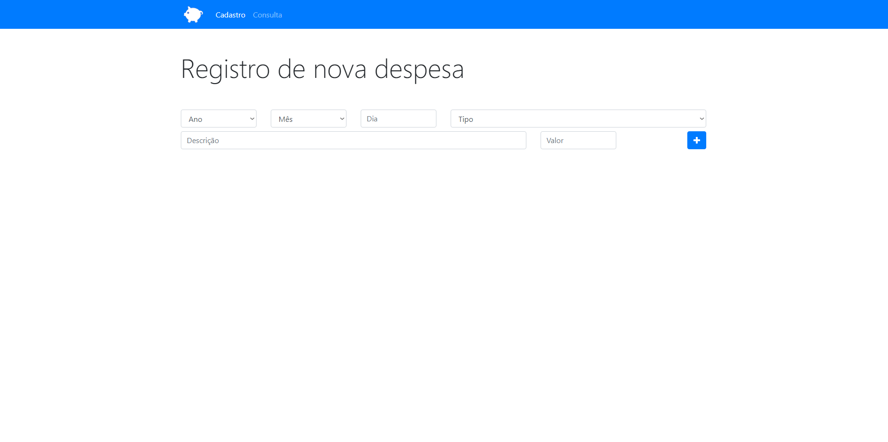

# Despesas-Projeto
Projeto para controle de despesas feito acompanhando o curso "Desenvolvimento Web Completo 2021" criado por Jorge Sant Ana e Jamilton Damasceno, na plataforma Udemy.

Estou criando este projeto para por em prática os conhecimentos adquiridos durante a cadeira ECMA Script 2015 (ES6) e Orientação a Objetos do curso citado acima.

